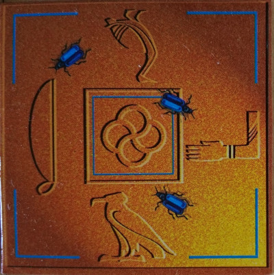

## Solver for 2D tile grid puzzles

This program was developed to find a solution to Lagoon puzzles 'Valley of the Kings'.
This is a set of 16 square tiles, with a symbol (hieroglyph) on each side.

To solve the puzzle you need to arrange the tiles in a 4x4 square such that the symbols
on each touching edge match. 

A sixteen-piece jigsaw sounded pretty easy to me but I spent a few hours on it and 
couldn't find the solution. Each piece can go in any of 4 rotations so you effectively
have 64 pieces, and the number of remaining pieces goes down by 4 each time you place one. 
Therefore I think the number of possible layouts is
(1/4) * 64 * 60 * 56 * ... * 4 which can be written as:
 

This is a huge number of possible layouts!

In fact it turns out that there are three pairs of cards which are duplicates of each other (in terms of
the hieroglyphs, they also have a symbol in the centre which is different but is not relevant for solving the puzzle)
which reduces the number of possible combinations by a factor of 8, leaving
2.8 * 10^21.

Anyway I couldn't solve it so I decided to write a python program, and here it is. It attempts to place cards in
order from top left to bottom right (row-wise), matching each card with those already placed.
If no card can be placed then it goes back one step and tries the next option for that position.

Once all the possible solutions are found, those which are functionally identical (whole layout rotated,
pairs of cards with same symbols swapped, or cards rotated in-place, to cover the case where a card
has 4 of the same symbol), are pruned down to one example. I found six distinct solutions to the original puzzle.

To run this you will need four installed python packages:
- numpy
- json
- PIL
- os

Since it's so simple I haven't added requirements.txt.

In theory this can be used
to solve any puzzle of this type, by specifying the set of tiles in the file card_list.json. 
So far I have only tested with the data here, and using square grids. Some work is at least needed
to fix the method of filtering duplicate (rotated) solutions, if it is used for a rectangular problem.

If anyone tries this with a different puzzle I'd be most grateful for your data!

See also: https://github.com/jselbie/PuzzleSolver

